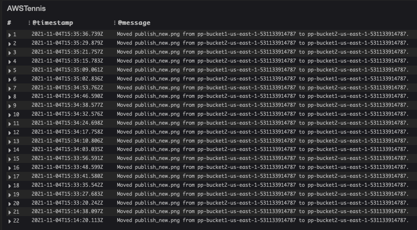
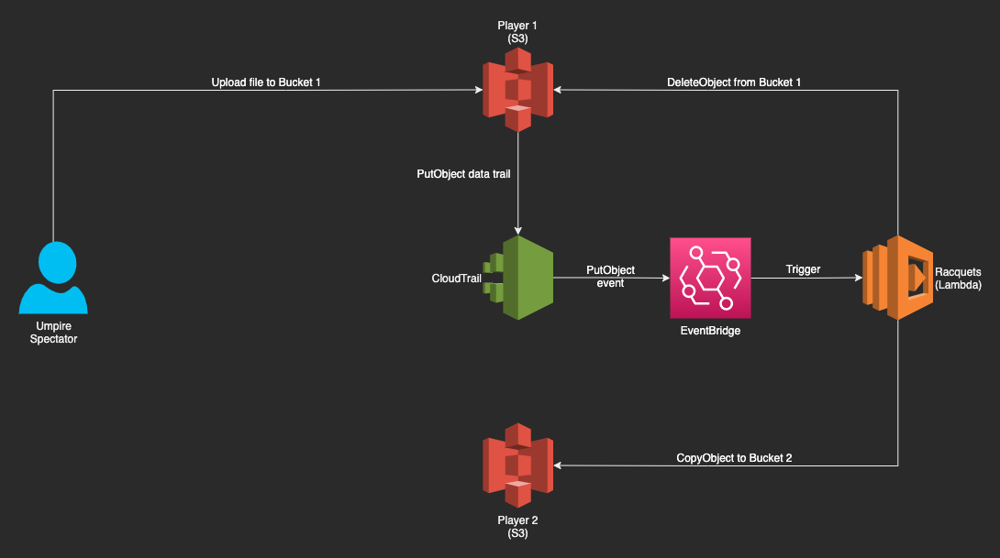
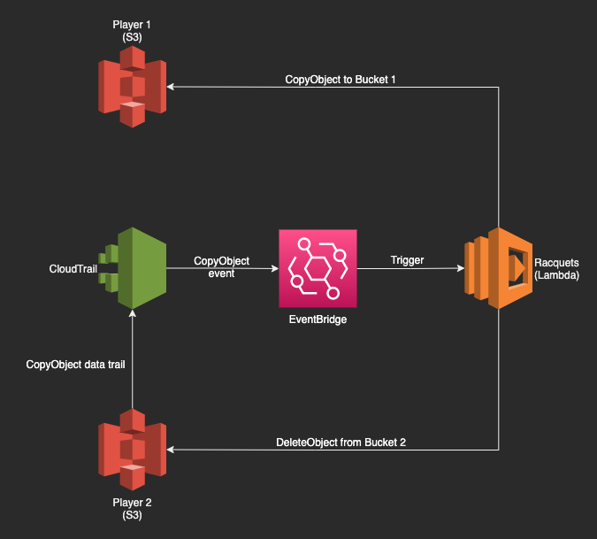
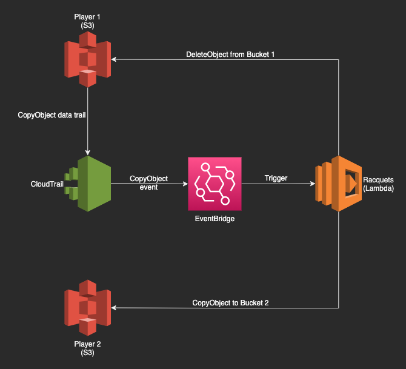

# aws-s3-tennis

Play tennis (or ping pong) with files in S3 using Lambda, EventBridge, and CloudTrail. Deployed with Terraform.

---

## TL;DR: Controls

- To start the match
    1. Set **ENABLED** to **true** in the Lambda function Environment Variables (This can be done using Terraform or manually in the AWS console. Terraform deploys this as **false** by default).
    2. Upload a file to one of the two storage buckets (not the CloudTrail bucket).

- To stop the match
    1. Set **ENABLED** to **false** in the Lambda function Environment Variables.

- Any error in the Lambda execution will stop the match as the file will not be able to be transferred between the two buckets.

## Overview

This infrastructure provisions two S3 buckets (plus another one for CloudTrail). Upload a file into one of the 2 buckets (either one will do) and watch the logs as the gets transferred back and forth between them.

> **CHARGES MAY APPLY**

The main purpose of this demonstrator is to show the illustrate how an event-driven architecture works. When a file is placed in S3 (or "moved" over from the other bucket), CloudTrail records a "PutObject" (or "CopyObject" in the case of a move) event from S3, triggering the Lambda function to move the file to the other bucket. This happens perpetually until the **ENABLED** switch in the Lambda function Environment Variables is set to **false**.

Each Lambda execution is logged in CloudWatch, so you can use it to "watch" the match using the provisioned dashboard (see Match Statistics).

## Match Statistics

### Game Plan

1. First hit  
      

2. Second hit  
      

3. Third hit (and so on and so forth)  
      
